# 🍎 AppleSeller

## Deskripsi Aplikasi

AppleSeller merupakan aplikasi penjualan produk Apple berbasis web yang dikembangkan menggunakan framework Laravel. Aplikasi ini dirancang untuk membantu pengelolaan data kategori, produk, dan transaksi penjualan secara efektif. Selain itu, aplikasi ini telah dilengkapi dengan autentikasi pengguna, pembagian hak akses Admin dan User, REST API, export data ke PDF dan Excel, serta dashboard yang menampilkan statistik penjualan.

---

## Identitas Mahasiswa

**Nama :** M. Ivandanizar

**NIM :** 240170174

---

## Teknologi yang Digunakan

- Laravel 12
- PHP 8.x
- MySQL
- Tailwind CSS
- Chart.js
- Laravel Breeze
- DomPDF
- Laravel Excel
- REST API
- Postman

---

# Cara Instalasi

## 1. Clone Repository

```bash
git clone https://github.com/ivandani14052018-oss/UASWEB-AppleSeller.git
```

## 2. Masuk ke Folder Project

```bash
cd UASWEB-AppleSeller
```

## 3. Install Dependency

```bash
composer install
```

```bash
npm install
```

## 4. Copy File Environment

```bash
cp .env.example .env
```

## 5. Generate Application Key

```bash
php artisan key:generate
```

## 6. Konfigurasi Database

Buat database baru, kemudian sesuaikan konfigurasi database pada file `.env`.

Contoh:

```env
DB_DATABASE=appleseller
DB_USERNAME=root
DB_PASSWORD=
```

## 7. Jalankan Migrasi

```bash
php artisan migrate
```

Apabila menggunakan seeder:

```bash
php artisan db:seed
```

## 8. Jalankan Aplikasi

```bash
npm run dev
```

Kemudian:

```bash
php artisan serve
```

Buka browser:

```
http://127.0.0.1:8000
```

---

# Akun Demo

## Admin

Email

```
admin@appleseller.com
```

Password

```
password
```

---

## User

Email

```
chatgpt@appleseller.com
```

Password

```
password
```

> **Catatan:** Sesuaikan akun demo dengan data pengguna yang terdapat pada database apabila berbeda.

---

# Fitur Aplikasi

- Login & Register
- Dashboard
- CRUD Kategori
- CRUD Produk
- CRUD Transaksi
- REST API
- Export PDF
- Export Excel
- Hak Akses Admin & User
- Responsive Design

---

# Dokumentasi Aplikasi

## 1. Halaman Login

> Tambahkan screenshot halaman login.

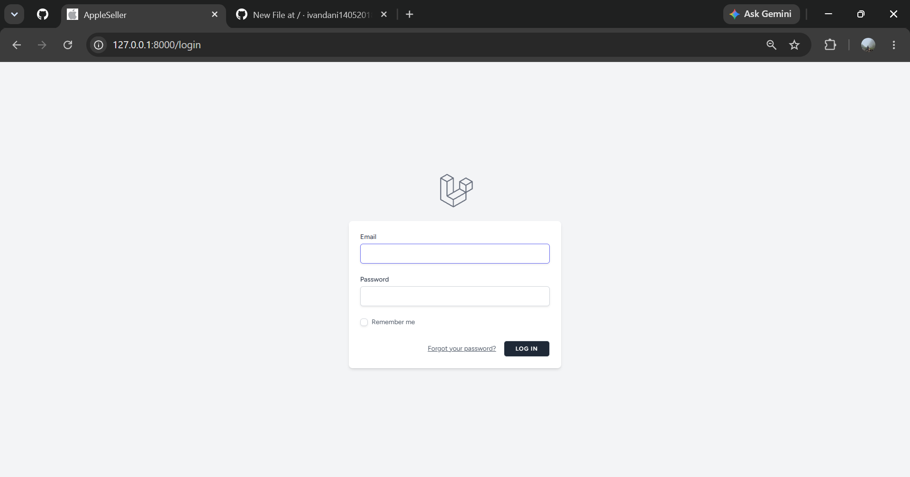

---

## 2. Verifikasi Email / Google Login

> Tambahkan screenshot fitur verifikasi email atau Google Login (jika digunakan).

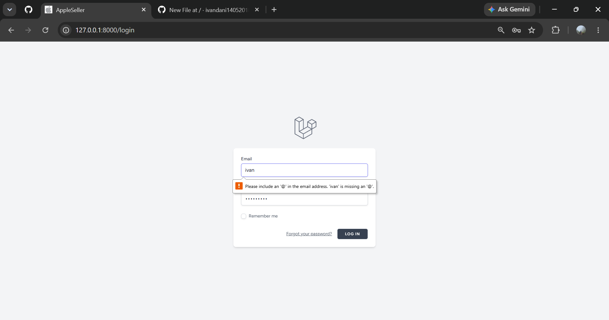

---

## 3. Dashboard

> Tampilan dashboard aplikasi.

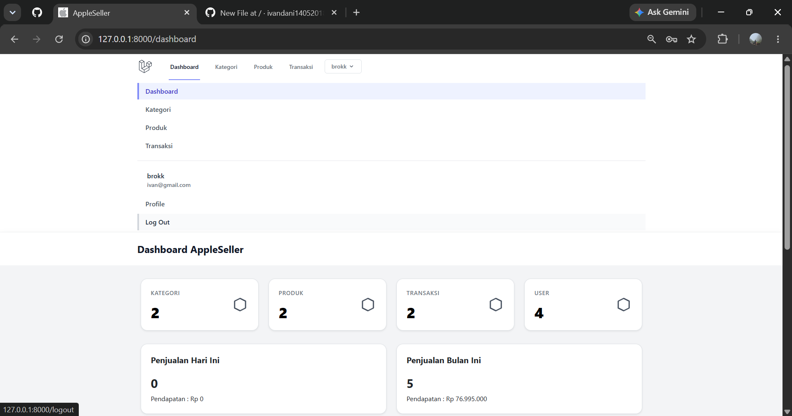

---

## 4. CRUD Kategori

### Data Kategori

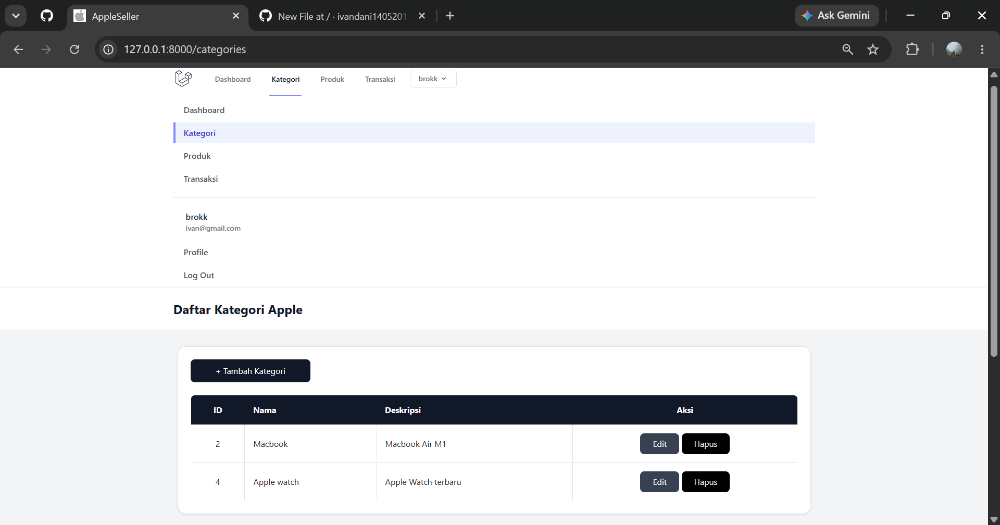

### Tambah Kategori

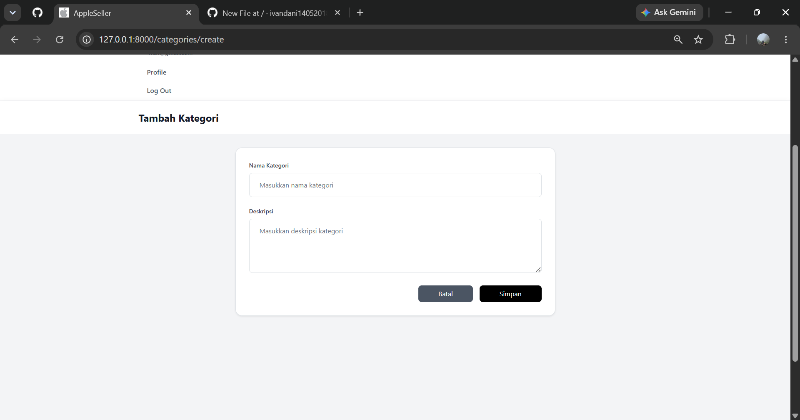

### Edit Kategori

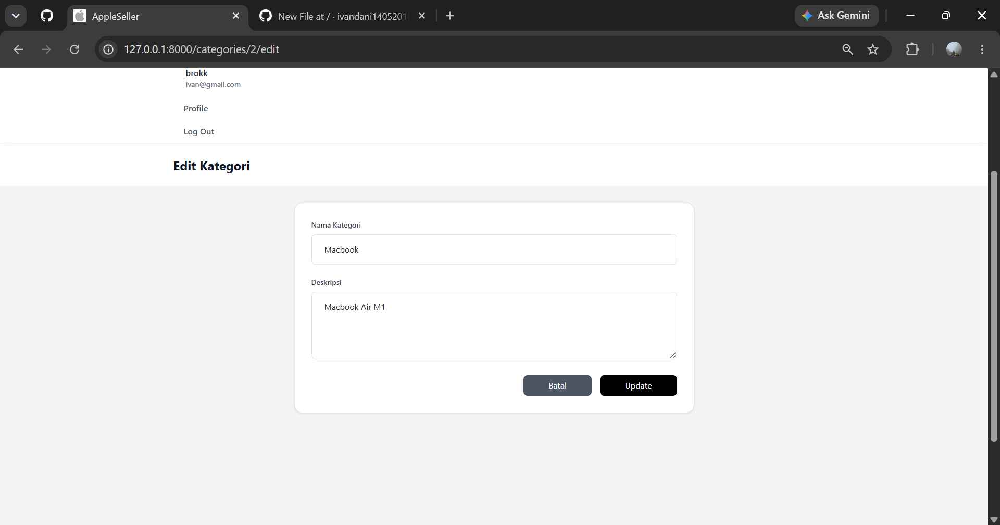

---

## 5. CRUD Produk

### Data Produk

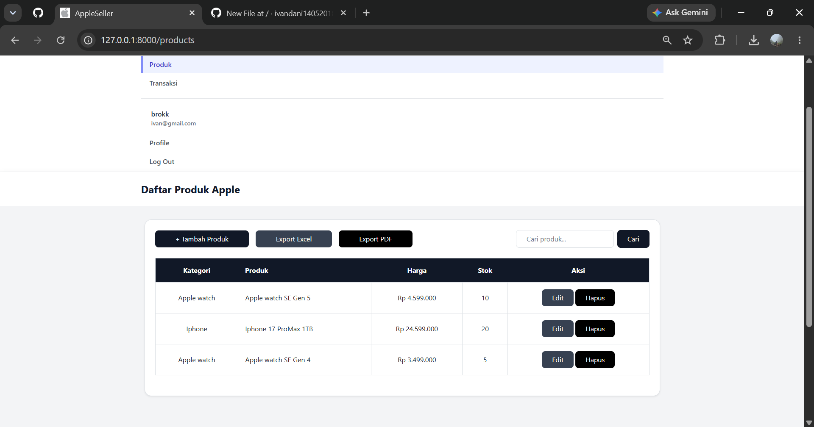

### Tambah Produk

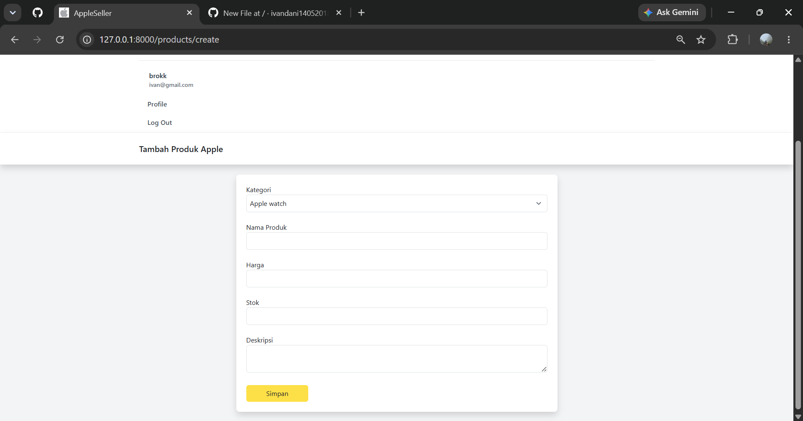

### Edit Produk

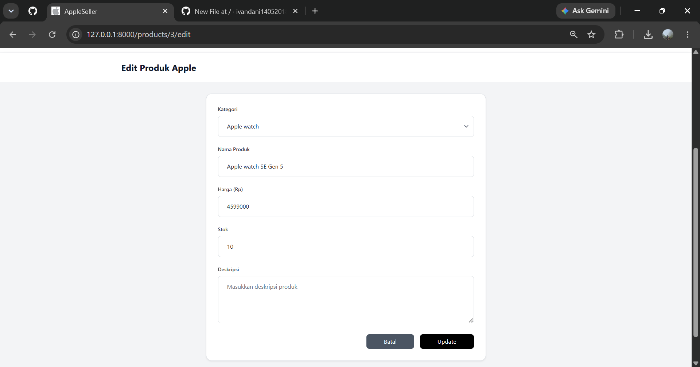

---

## 6. CRUD Transaksi

### Data Transaksi

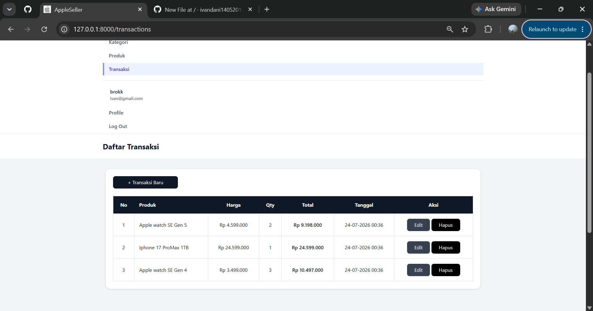

### Tambah Transaksi

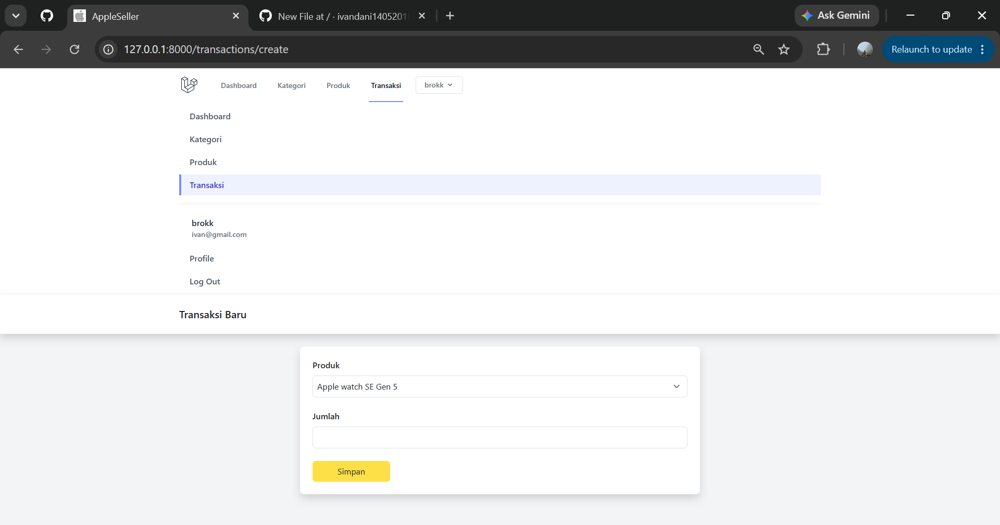

### Edit Transaksi

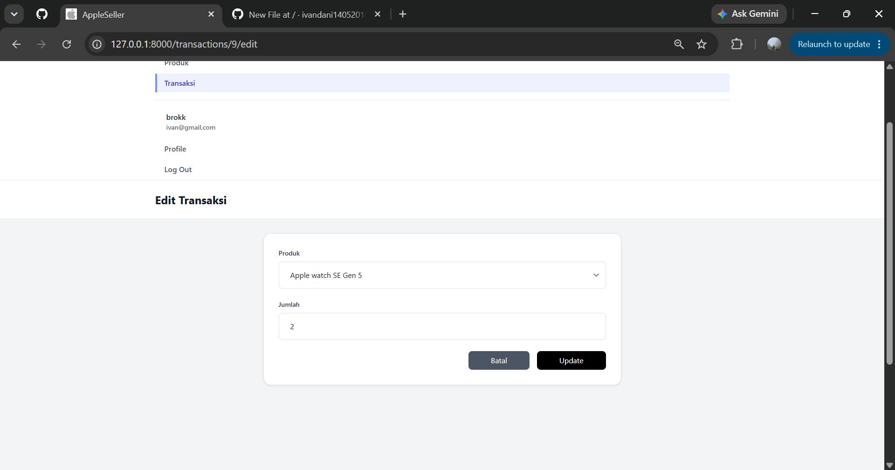

---

# REST API

Pengujian REST API dilakukan menggunakan aplikasi **Postman**.

## GET Products

Endpoint

```
GET /api/products
```

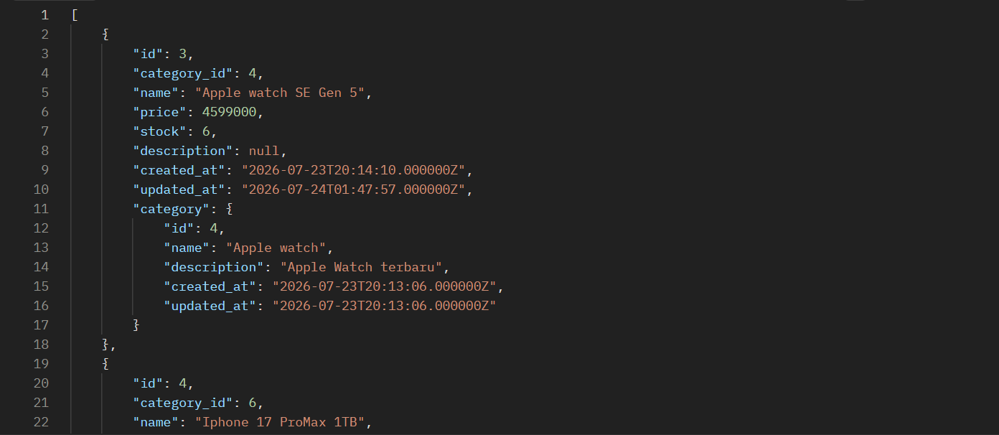

---

## GET Categories

Endpoint

```
GET /api/categories
```

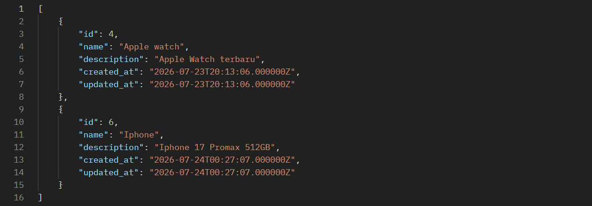

---

## GET Transactions

Endpoint

```
GET /api/transactions
```

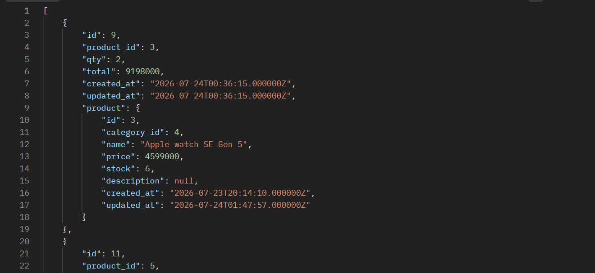

---

# Hak Akses

## Admin

Admin memiliki hak akses penuh terhadap aplikasi, meliputi:

- Dashboard
- CRUD Kategori
- CRUD Produk
- CRUD Transaksi
- Export PDF
- Export Excel

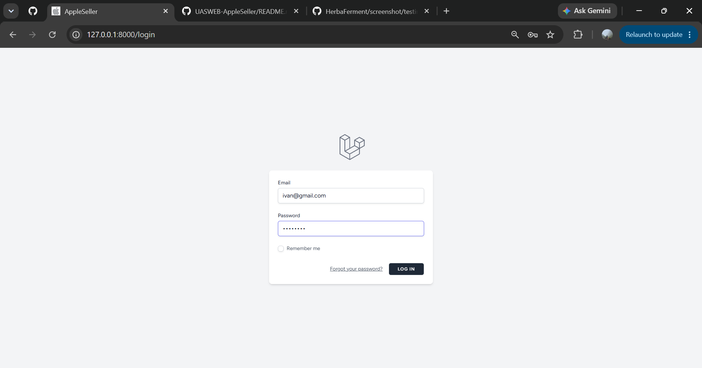

---

## User

User hanya dapat mengakses fitur yang telah diberikan sesuai hak akses.

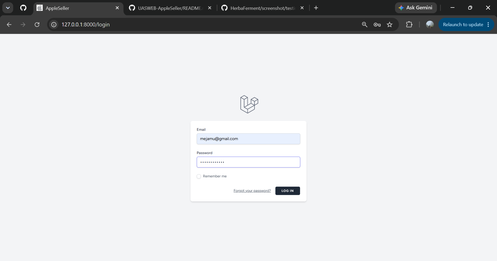

---

# Responsive Design

## Desktop


---

## Mobile


---

# Export Data

## Export PDF


---

## Export Excel

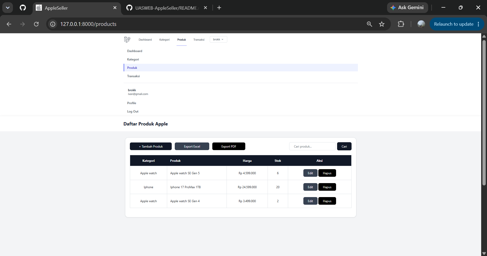

---

# Struktur REST API

| Method | Endpoint | Keterangan |
|---------|----------|------------|
| GET | `/api/products` | Menampilkan seluruh data produk |
| POST | `/api/products` | Menambahkan produk |
| PUT | `/api/products/{id}` | Mengubah produk |
| DELETE | `/api/products/{id}` | Menghapus produk |
| GET | `/api/categories` | Menampilkan seluruh kategori |
| POST | `/api/categories` | Menambahkan kategori |
| PUT | `/api/categories/{id}` | Mengubah kategori |
| DELETE | `/api/categories/{id}` | Menghapus kategori |
| GET | `/api/transactions` | Menampilkan seluruh transaksi |
| POST | `/api/transactions` | Menambahkan transaksi |
| PUT | `/api/transactions/{id}` | Mengubah transaksi |
| DELETE | `/api/transactions/{id}` | Menghapus transaksi |

---

# Penutup

Aplikasi AppleSeller telah berhasil dikembangkan menggunakan framework Laravel dengan menerapkan konsep autentikasi, manajemen data menggunakan CRUD, REST API, pembagian hak akses pengguna, export data ke PDF dan Excel, serta antarmuka yang responsif pada berbagai ukuran perangkat.
